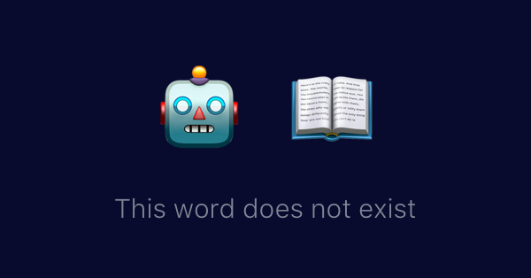

# This Word Does Not Exist
This is a project allows 
people to train a variant of GPT-2 that makes
up words, definitions and examples from scratch. 

For example

> **incromulentness** (noun)
>
> lack of sincerity or candor
>
> *"incromulentness in the manner of speech"*

Check out https://www.thisworddoesnotexist.com as a demo 

Check out https://twitter.com/robo_define for a twitter bot demo

## Training a model
For raw thoughts, take a look at some of the notebooks in https://github.com/turtlesoupy/this-word-does-not-exist/tree/master/notebooks

To train, you'll need to find a dictionary -- there is code to extract from 
- Apple dictionaries in https://github.com/turtlesoupy/this-word-does-not-exist/blob/master/title_maker_pro/dictionary_definition.py (e.g. `/System/Library/Assets/com_apple_MobileAsset_DictionaryServices_dictionaryOSX/`). 
- Urban dictionary in https://github.com/turtlesoupy/this-word-does-not-exist/blob/master/title_maker_pro/urban_dictionary_scraper.py

After extracting a dictionarty you can use the master training script: https://github.com/turtlesoupy/this-word-does-not-exist/blob/master/title_maker_pro/train.py. A sample recent run is https://github.com/turtlesoupy/this-word-does-not-exist/blob/master/scripts/sample_run_parsed_dictionary.sh


## Generating Words / Running Inference
Python deps are in https://github.com/turtlesoupy/this-word-does-not-exist/blob/master/cpu_deploy_environment.yml

Pre-trained model files:
- Blacklist: https://storage.googleapis.com/this-word-does-not-exist-models/blacklist.pickle.gz
- Forward Model (word -> definition): https://storage.googleapis.com/this-word-does-not-exist-models/blacklist.pickle.gz
- Inverse model (definition -> word): https://storage.googleapis.com/this-word-does-not-exist-models/blacklist.pickle.gz

To use them:
```
from title_maker_pro.word_generator import WordGenerator
word_generator = WordGenerator(
  device="cpu",
  forward_model_path="<somepath1>",
  inverse_model_path="<somepath2>",
  blacklist_path="<blacklist>",
  quantize=False,
)
print(word_generator.generate_word()) # a word from scratch
print(word_generator.generate_definition("glooberyblipboop")) # definition for a word you make up
print(word_generator.generate_word_from_definition("a word that does not exist")) # new word made up from a definition
```

## Website Development Instructions
```
cd ./website
pip install -r requirements.txt
pip install aiohttp-devtools 
adev runserver
```
